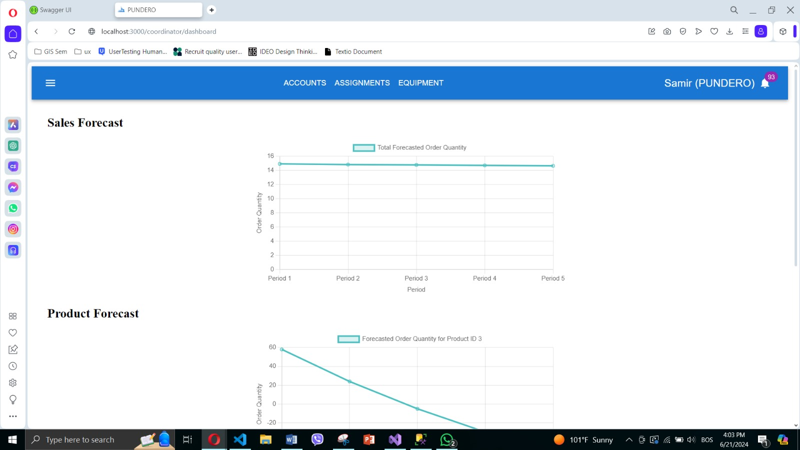
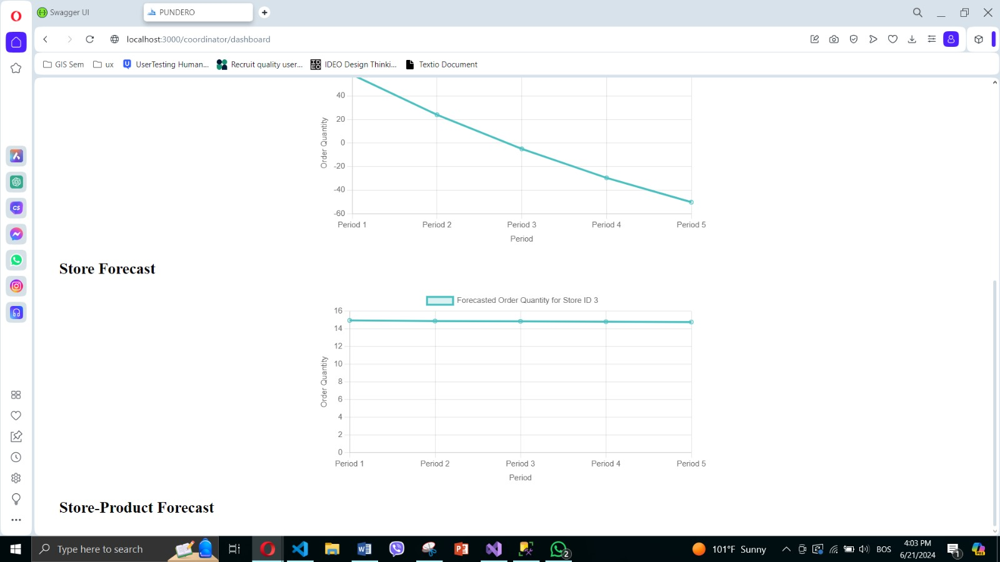

# PUNDERO – Backend (.NET Core Web API)

This is the backend service for the **PUNDERO** system – a delivery and route management solution for small distribution companies. The system supports three user roles (coordinator, driver, client) and is built as a modular .NET Core Web API.

**Frontend repo:** [PUNDERO-FE (React JS)](https://github.com/azradaut/PUNDERO-FE)  
**Mobile repo (driver tracking):** [Pundero-vehicle (.NET MAUI)](https://github.com/azradaut/Pundero-vehicle)  
**Demo video:** [Watch on Vimeo](https://vimeo.com/1105660593)

## Features

- RESTful API structure with clear separation of concerns
- Authentication and authorization for three user roles (JWT-based)
- CRUD endpoints for managing users, assignments, vehicles, equipment, and delivery data
- Optimized API endpoints for route assignment and live tracking
- Integration-ready with Google Maps API (used on frontend/mobile)

## Architecture

- ASP.NET Core Web API (.NET 6)
- Entity Framework Core (Code First)
- SQL Server database
- JWT Authentication
- CORS enabled for FE/Mobile clients

## Forecasting Module (Sales Prediction)

>  *This feature was added after the main demo video was recorded.*

The backend includes a basic forecasting module to predict delivery trends using linear regression. It offers predictions on:

- Total future orders across all products and stores
- Per-product forecasts
- Per-store forecasts
- Per store-product combination (if enough input data)

Endpoints:
- `/api/forecast/sum`
- `/api/forecast/product/{id}`
- `/api/forecast/store/{id}`
- `/api/forecast/store-product/{storeId}/{productId}`

### Dashboard Preview

Below are coordinator dashboard examples where these predictions are visualized:

